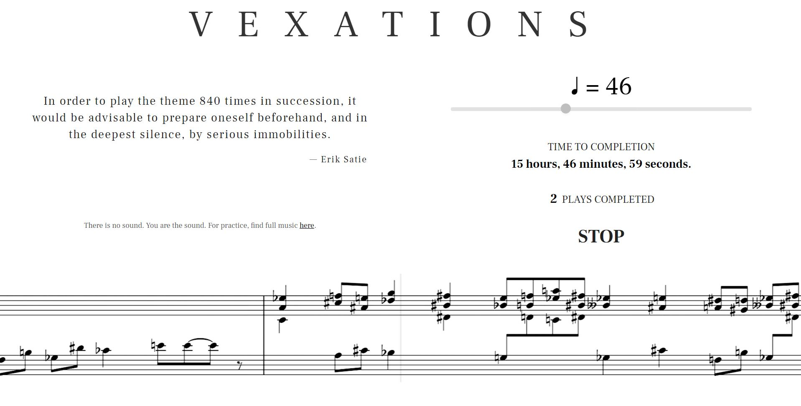

# Vexations

Erik Satie wrote a piano piece called "[Vexations](https://en.wikipedia.org/wiki/Vexations)" some time in 1893-1894. He wrote one of his typically cryptic notes on it indicating that he thinks it ought to be played 840 times in a row. This is a web app to help you do that.

Put your computer or tablet on your piano, select the tempo, hit BEGIN, and off you go. Good luck!

This app is live [here](https://thischrisblack.github.io/vexations/)

